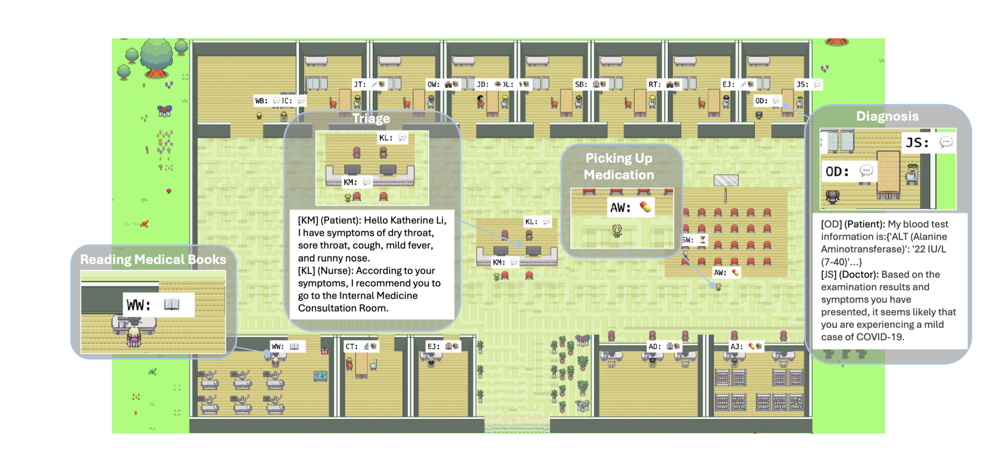

### AI医院: Multi-Agent 医学智能体
与患者进行多轮对话，提出相关和探索性的问题，推荐适当的医学检查，并在收集足够的信息后做出诊断。设置检查员，他们专门负责与患者互动并提供相关的医学检查结果，确保医生能够获得患者必要的客观信息以做出准确诊断。此外，主治医生负责在整个会话后评估医生的表现。
模拟患者与多名医生之间的互动，包括体检结果的收集和最终诊断。
## 环境设置
运行以下命令以设置您的环境：
```
pip install -r requirements.txt
```


进入源目录：
```
cd ./src
```
api_key配置
```
erport OPENAI_API_KEY=''
erport DASHSCOPE_API_KEY=''
```

执行脚本：
```
 python -u run.py \
--model_name Baichuan \
--dataset_name MedQA \
--dataset_dir ./datasets/MedQA/ \
--start_pos 0 \
--end_pos -1 \
--output_files_folder ./outputs/MedQA/ \
--max_attempt_vote 3
```

### 评估性能
要评估性能，请进入源目录并执行：
```
cd ./src
bash scripts/eval.sh
```
